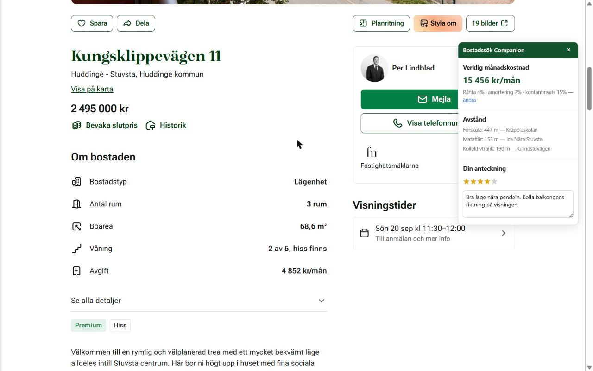

# Bostadssök Companion

A Chrome extension for Swedish home search. It adds two things to a Hemnet or Booli listing that neither site shows you: what the home would actually cost you every month, and how far it is to the places you go every day.

**Live on the Chrome Web Store:** [Bostadssök Companion — verklig kostnad & avstånd](https://chromewebstore.google.com/detail/jillkpkjhjnkkmjknkianlkhmmlkifgn) · free · published by Tellra



## Why

Hemnet shows the monthly *avgift*. That is not what the home costs you — the mortgage is, and the mortgage depends on assumptions the listing knows nothing about: your interest rate, your amortisation rate, how much you put down.

Hemnet also shows distance to water. Useful once. What decides whether a place works day to day is distance to a preschool, a grocery shop and a bus stop, and that is not on the page at all.

So the extension computes the first and fetches the second, and draws both into a panel on the listing itself.

## What it does

**Real monthly cost.** Interest and amortisation on the loan portion, plus avgift and driftkostnad — from your own assumptions for ränta, amortering and kontantinsats, editable at any time on the options page. Change the interest rate and every listing you open afterwards is recalculated against it.

**Distances that matter.** Nearest förskola, mataffär and kollektivtrafik, in metres, each with its name. Fetched per listing and cached for 30 days against the address.

**Your own notes.** A star rating and a free-text note per home, stored locally — and shared between Hemnet and Booli when the same address is listed on both, so a note written on Hemnet is there on the Booli page for the same home.

**Nothing leaves the browser but the address.** No account, no backend, no analytics. The only outbound requests are the address to OpenStreetMap's geocoding and POI services. Notes, ratings and settings live in `chrome.storage`.

## How it works

`content.js` runs on the listing page and reads the **visible text**, not CSS class names, to find price, avgift, driftkostnad and boarea. Hemnet and Booli redesign often; class names break on a redesign, the words "Avgift" and "kr/mån" do not. The trade-off is that an unusual listing layout gets missed rather than misread.

`background.js` geocodes the address through **Nominatim** and queries **Overpass** for the nearest preschool, grocery shop and transit stop. Both are free, keyless OpenStreetMap services. Results are cached for 30 days per address, so reopening a listing costs no requests.

| File | What it does |
| --- | --- |
| `manifest.json` | MV3 manifest — `storage` permission, host permissions, content-script matches |
| `content.js` | Text extraction from the listing, panel rendering |
| `background.js` | Service worker — geocoding, Overpass queries, caching |
| `overlay.css` | Panel styling |
| `options.html` / `options.js` | Ränta, amortering and kontantinsats settings |
| `popup.html` / `popup.js` | Saved homes with their ratings |

## Stack

Vanilla JavaScript, HTML and CSS on **Chrome Manifest V3**. No framework, no build step, no dependencies — the folder in this repo is the extension, byte for byte. Geocoding via Nominatim, points of interest via Overpass.

Permissions are deliberately narrow: `storage`, plus host access to exactly five origins — `hemnet.se`, `booli.se`, and the three OpenStreetMap endpoints. No `tabs`, no `<all_urls>`, no analytics SDK.

## Running it locally

```
git clone https://github.com/abboud-said/bostadssok-companion.git
```

1. Open `chrome://extensions`
2. Turn on **Developer mode** (top right)
3. **Load unpacked** → select the cloned folder
4. Open any listing on `hemnet.se/bostad/...` or `booli.se/annons/...`

The panel appears on the listing. Set your own ränta, amortering and kontantinsats on the extension's options page — the defaults are only a starting point.

## Known limits

- **Text extraction can miss unusual listings.** Houses without an avgift, or terraced houses using different labels, may not be fully parsed. Extended as real cases turn up.
- **Bostadsrättsföreningens ekonomi is not modelled.** The association's own debt per square metre matters a great deal to a real purchase and is not read — only the home's own figures are.
- **Geocoding misses some addresses** — new builds not yet in OpenStreetMap, rural properties without a street number.
- **The free APIs do not scale.** Nominatim and Overpass are community-run with firm fair-use limits (roughly one request per second, no commercial bulk use). Fine for personal use and a small beta. Before any real user growth the geocoding has to move to a paid provider, or the extension risks getting the user's IP blocked by OSM.

## Privacy

[Privacy policy](https://bostadssok-privacy.vercel.app/). Short version: notes, ratings and settings stay in your browser; the listing address is sent to OpenStreetMap to compute distances; nothing is collected, sold or shared.

## Store listing

`store-listing.md` holds the published Web Store copy, and `CHROMEWEBSTORE.md` the permission justifications submitted with it. Current version is **0.1.1**.
